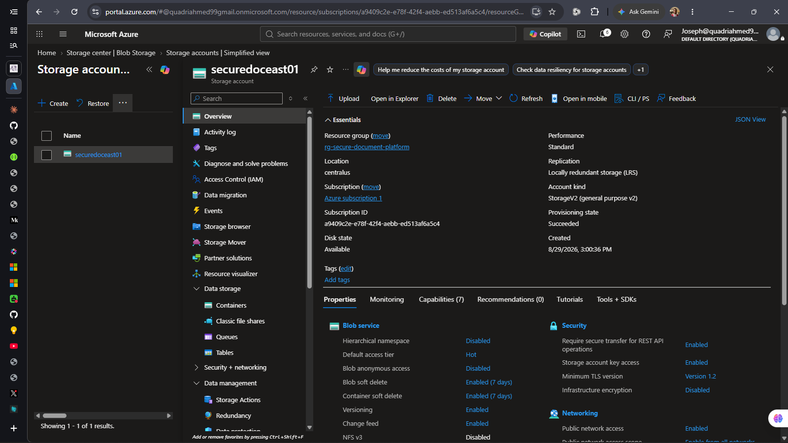
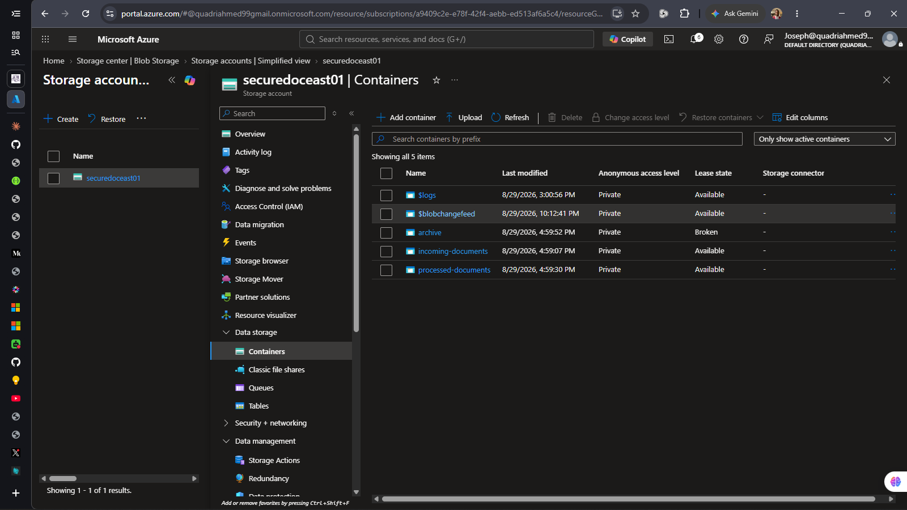
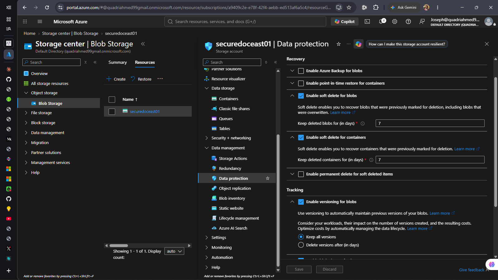
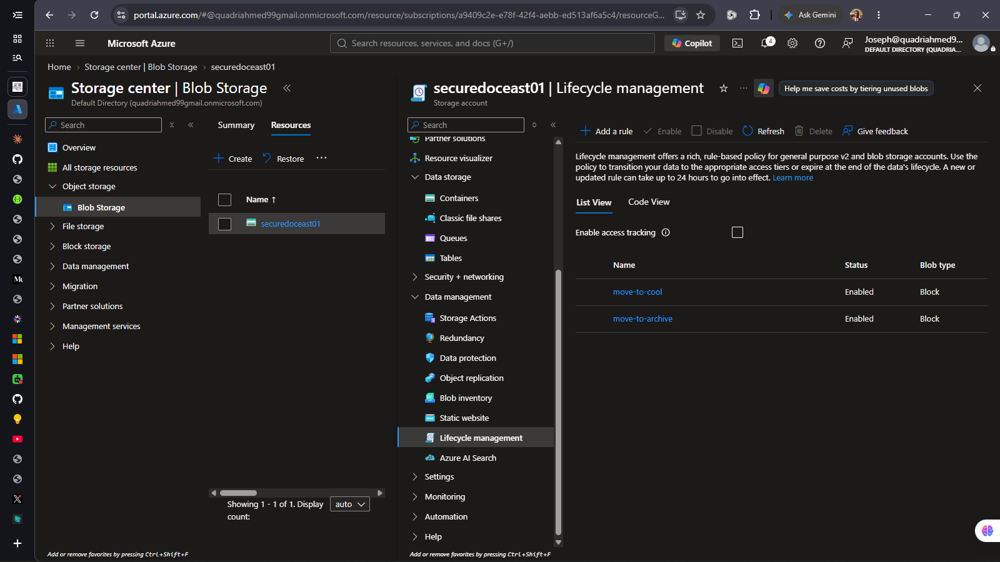
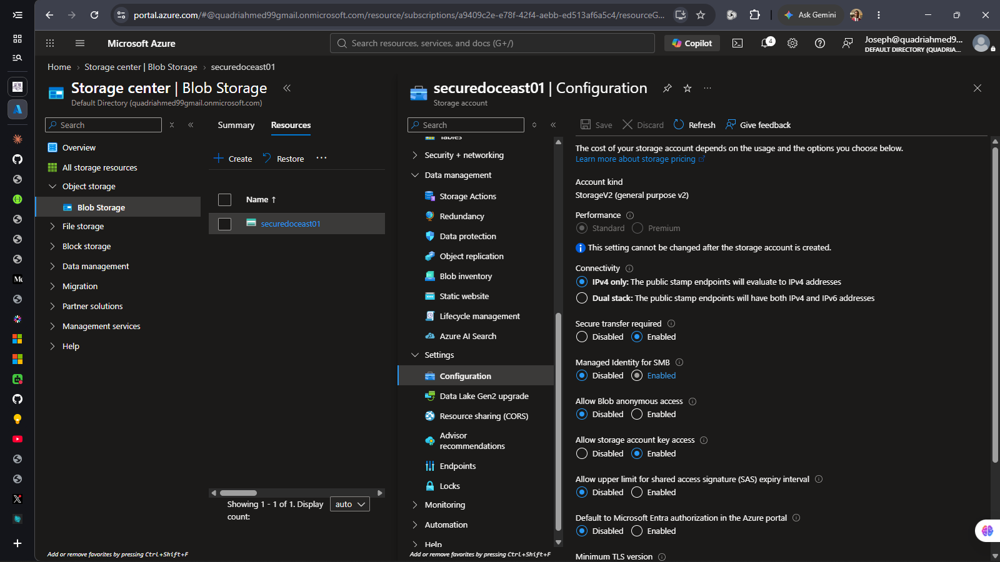
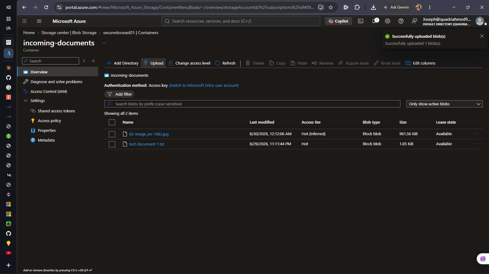
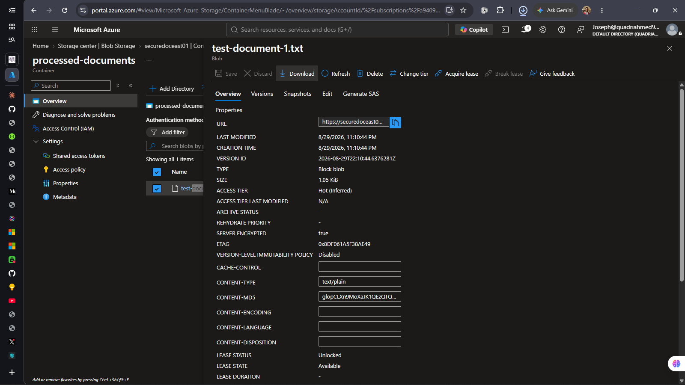
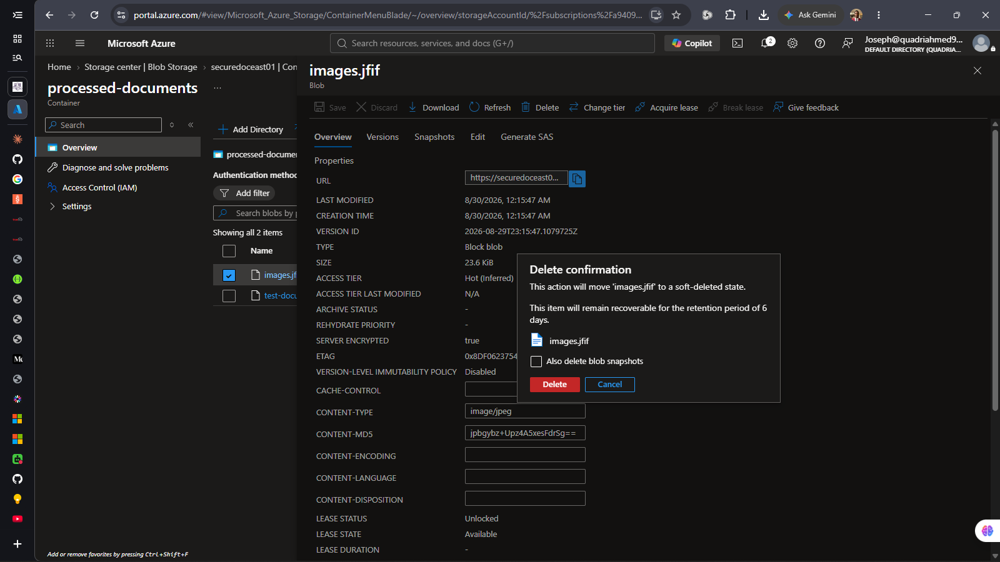
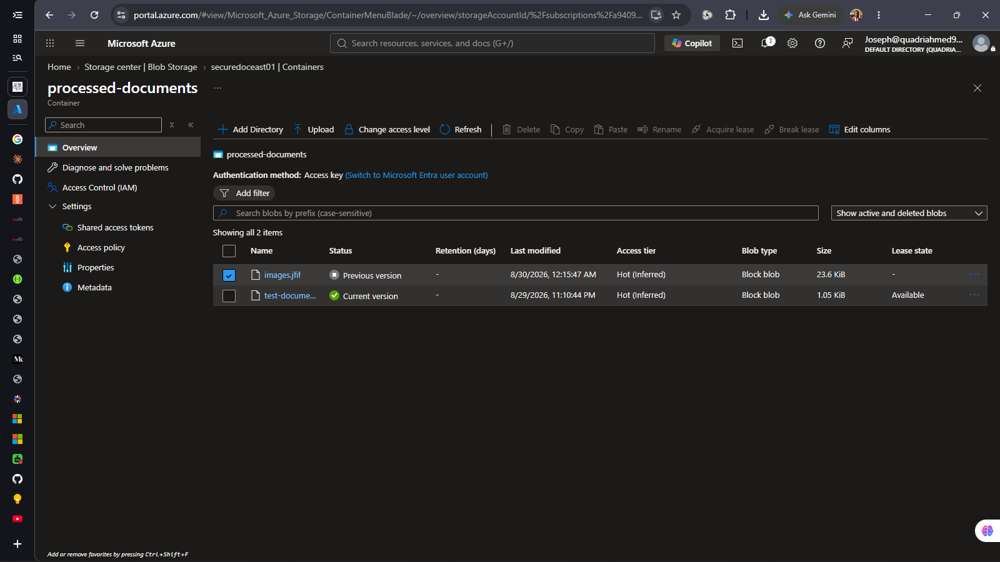

Azure Storage Account Implementation - Project Documentation

Project: Secure Document Management System  
Storage Account: securedoceast01  

#**My Responsibilities**
```
* Create the Azure Storage Account
* Create the incoming documents container
* Create the processed documents container
* Create the archive container
* Configure the Blob access tier for the storage account
* Choose the appropriate access tier for the project
* Configure soft delete
* Configure Blob versioning
* Configure data protection settings
* Enable secure transfer
* Disable public access
* Upload several test documents
* Test uploading, downloading and deleting documents
* Test recovering a deleted document when soft delete is enabled
```

____________________________________________________________________________________________________________________________
<br>

Task 1: Storage Account Foundation

 What I Did: 
I created the foundational Azure Storage Account that will serve as the central repository for document management across the organization. The storage account was configured with:
```
Storage Account Name:     securedoceast01
Account Type:             StorageV2 (General Purpose v2)
Performance Tier:         Standard
Redundancy:               LRS (Locally Redundant Storage)
Region:                   Central US
Minimum TLS Version:      1.2
Secure Transfer:          Enabled
Public Access:            Disabled
```

 What I Learned:
I learned that StorageV2 (General Purpose v2) is the recommended account type for most workloads because it:
- Supports all Azure Storage services (blobs, files, queues, tables)
- Allows container-level access tier management (hot, cool, archive)
- Provides better pricing for blob operations
- Supports lifecycle policies for automatic cost optimization

I also learned that LRS (Locally Redundant Storage) replicates data within a single datacenter, providing cost efficiency while maintaining protection against single disk failures. For multi-region failover, GRS would be needed, but LRS is appropriate for our initial deployment.
The TLS 1.2 minimum requirement is a security baseline that ensures older, less secure protocols cannot be used to access the storage account.

 Problems I Faced
- Initially uncertain about whether to choose LRS vs. GRS for redundancy
- Unclear about the difference between StorageV1 and StorageV2 account types
- Needed clarification of what "Minimum TLS Version" means and whether it affects access

 How I Fixed It
I reviewed the Azure Storage architecture documentation and learned that:
1. LRS vs. GRS: LRS is cost-effective for non-critical data and single-region deployments. GRS provides geo-redundancy. For our use case, LRS is appropriate initially with the option to upgrade to GRS later if multi-region failover becomes required.
2. StorageV1 vs. V2: StorageV2 is the current generation and provides better functionality. StorageV1 is legacy. StorageV2 was the clear choice.
3. TLS Minimum Version: Setting TLS 1.2 minimum means that older clients using TLS 1.0 or 1.1 will be rejected. This is a security requirement, and modern Azure SDKs use TLS 1.2 by default.


Storage Account Overview:



____________________________________________________________________________________________________________________________
<br>

 Task 2: Container Architecture Setup
 
 What I Did:
 I created the three-tier container architecture that defines the document workflow and data lifecycle.
The containers created were:
```
Container 1: incoming-documents
  - Purpose: New document uploads, staging area
  - Access Level: Private (no anonymous access)
  - Tier: Hot (frequent access)

Container 2: processed-documents
  - Purpose: Validated, transformation-ready documents
  - Access Level: Private
  - Tier: cool  (active application use)

Container 3: archive-documents
  - Purpose: Long-term retention (7+ years)
  - Access Level: Private
  - Tier: Cold → Archive (lifecycle-managed)
```

All containers were configured with Private access level, meaning no anonymous/public access is allowed.

 What I Learned

I learned that container naming and purpose definition are critical because:

- Clear naming makes the container's role immediately obvious to team members
- Separate containers allow different lifecycle policies and access tiers to be applied independently
- Private access prevents accidental exposure of data to the internet
- Three-tier architecture creates a natural document workflow: upload → process → archive

I also learned that Azure containers are flat storage (unlike file systems with folders). However, we can simulate folder structures using blob naming conventions like `documents/2026/08/filename.pdf`.

 Problems I Faced
- Uncertainty about whether to create separate containers or use folder-like structures within a single container
- Needed to understand the trade-offs between separate containers vs. single container with multiple folders

 How I Fixed It
I reviewed Azure Storage best practices and learned that:
1. Separate containers provide independent access control, lifecycle policies, and cost tracking
2. Single container with folders is simpler initially but harder to manage as data grows
3. Our use case (document workflow with different access tiers) benefits from separate containers

The decision to create three separate containers was the right choice for our workflow.
The three-tier container architecture was successfully deployed and provides a clear data flow structure.

All Containers Created:



____________________________________________________________________________________________________________________________
<br>

 Task 3: Data Protection Configuration
 What I Did: I configured four layers of data protection to guard against accidental deletion, malicious modification, and data loss scenarios.

The data protection features implemented were:

```
Feature 1: Soft Delete
  - Blob Soft Delete: ENABLED (7-day retention)
  - Container Soft Delete: ENABLED (7-day retention)
  - Effect: Deleted blobs can be recovered for 7 days

Feature 2: Blob Versioning
  - Status: ENABLED
  - Retention: Keep all versions
  - Effect: Every blob modification creates a new version

Feature 3: Encryption at Rest
  - Status: ENABLED (automatic, default)
  - Type: Microsoft-managed keys
  - Effect: All data encrypted on disk

Feature 4: Encryption in Transit
  - Secure Transfer: REQUIRED
  - Minimum TLS: 1.2
  - Effect: All API calls must use HTTPS
```

 What I Learned

I learned the critical difference between soft delete and blob versioning:

- Soft Delete protects against accidental deletion. When a blob is deleted, it moves to a "soft deleted" state and can be recovered for 7 days.
- Blob Versioning protects against modification. Every time a blob is modified, a new version is created automatically, and the previous version can be restored.

I also learned that soft delete and versioning incur additional storage costs because:
- Soft delete: Stores the deleted blob snapshot during the retention period
- Versioning: Stores every previous version of a blob

However, for our use case, these costs are minimal and worth the protection they provide.

 Problems I Faced:
- Confusion about whether to enable both soft delete AND versioning, or just one
- Uncertainty about the cost implications of versioning
- Unclear about how to recover from soft delete vs. how to recover from versioning

 How I Fixed It:
I created a decision matrix showing that both should be enabled because they solve different problems:

1. Soft Delete (7-day) for accidental/malicious deletion
2. Versioning (indefinite) for accidental/malicious modification

I also verified that the combined cost impact is acceptable (~$0.50/month for versioning + negligible for soft delete).

 Final Result

All four data protection layers are now active and provide comprehensive protection against data loss scenarios.

Data Protection Settings Enabled:



____________________________________________________________________________________________________________________________
<br>


Task 4: Lifecycle Management

What I Did: 
 I configured automated lifecycle management policies that transition blobs between access tiers based on age, optimizing costs without sacrificing recovery capability.

Two lifecycle rules were created:
```
Rule 1: Move to Cool Tier
  Name:        move-to-cool
  Condition:   Last modified > 30 days ago
  Action:      Transition to Cool tier
  Container:   archive-documents
  Status:      ENABLED

Rule 2: Move to Archive Tier
  Name:        move-to-archive
  Condition:   Last modified > 90 days ago
  Action:      Transition to Archive tier
  Container:   archive-documents
  Status:      ENABLED
```

 What I Learned: 
I learned that lifecycle management is not automatic immediately. The policies are evaluated once per day (usually overnight), and changes take up to 24 hours to take effect.

This means:
- If a blob is modified today, it won't move to Cool tier tomorrow (the policy requires 30+ days)
- The lifecycle policy is meant for data that ages over weeks/months, not for immediate transitions
The decision to use lifecycle management is about future-proofing for cost optimization as data grows.

 Problems I Faced

- Expected blobs to move to Cool tier immediately after creating the policy
- Uncertainty about whether 90 days was the right threshold
- Wanted to test the lifecycle policy but didn't want to wait 90 days

 How I Fixed It
1. Lifecycle policies take 24 hours to process - This is by design. I documented this in the operations manual.

2. 30 days is a business decision - We chose 30 days because:
   - Documents younger than 30 days are typically still being accessed
   - Documents older than 30 days move to Cool tier 
   - Documents older than 90 days move to Archive tier 

3. Testing lifecycle policies - For testing, I can manually change a blob's tier using the Azure Portal's "Change tier" button, which provides immediate feedback without waiting for the automatic policy.

 Final Result


Lifecycle Rules Configured:



____________________________________________________________________________________________________________________________
<br>


Task 5: Security Hardening

 What I Did
I implemented security hardening to ensure all access is encrypted and authenticated.
Two critical security configurations were applied:

```
Configuration 1: Enable Secure Transfer (HTTPS Only)
  Setting:     Secure Transfer Required: ENABLED
  Effect:      All API calls must use HTTPS
  Result:      HTTP requests are rejected (403 Forbidden)

Configuration 2: Disable Public Access
  Setting:     Allow Blob Anonymous Access: DISABLED
  Setting:     Disable public access to blobs and containers: ENABLED
  Effect:      All access requires authentication
  Result:      Even if a container is accidentally set to Public,
               the account-level override prevents anonymous access
```

 What I Learned:
I learned the concept of defense-in-depth - having multiple layers of security so that if one fails, others still protect the data.

Security Layers Implemented:

| 1 | Secure Transfer (HTTPS) | Encrypts data in transit |
| 2 | Public Access Disabled | Prevents accidental public exposure |
| 3 | Authentication Required | API calls need connection string/SAS token |
| 4 | Encryption at Rest | Data encrypted on disk |
| 5 | Soft Delete | Can recover from accidental/malicious deletion |
| 6 | Versioning | Can recover from accidental/malicious modification |

I also learned that the account-level public access override is critical. Even if someone accidentally sets a container to "Public" access, the account-level override prevents any anonymous access from working.

 Problems I Faced
- Initially didn't understand why we needed both secure transfer AND public access disabled (they seem to address different things)
- Wanted to verify that public access was disabled

 How I Fixed It
I realized these controls address different attack vectors:
1. Secure Transfer (HTTPS) - Protects against man-in-the-middle attacks during data transmission
2. Public Access Disabled - Prevents unauthorized users from accessing data without credentials
Both are necessary. HTTPS alone doesn't prevent an authenticated user from accessing data they shouldn't see. Public access disabled alone doesn't encrypt the data in transit.


 Final Result

The storage account is now hardened against unauthorized access and data interception.

Security Configuration Hardened:



____________________________________________________________________________________________________________________________
<br>


 Task 6: Testing & Validation

What I Did:
I conducted comprehensive testing of all critical workflows to verify the system works as expected and data protection features function.

The testing included:
```
Test 1: Upload Documents
  - Uploaded 3 files to incoming-documents container
  - Files: test-document-1.txt (1.05 KiB), images.jiff (23.6 KiB), 
           63-image-en-1983.jpg (961.56 KiB)
  - Result: ✅ All files uploaded successfully

Test 2: Download Documents
  - Downloaded test-document-1.txt from processed-documents
  - Verified file integrity (size matches)
  - Result: ✅ Download works correctly

Test 3: Delete Documents
  - Deleted images.jiff from processed-documents
  - Blob moved to soft-deleted state (not immediately purged)
  - Result: ✅ Soft delete confirmed

Test 4: Recover from Soft Delete
  - Located deleted blob using "Show deleted blobs" toggle
  - Clicked "Undelete" to restore blob
  - Blob returned to active state
  - Result: ✅ Soft delete recovery works (7-day window confirmed)

Test 5: Blob Versioning
  - Uploaded test-document-3.txt (Version 1)
  - Re-uploaded with different content (Version 2)
  - Verified version history was visible
  - Downloaded previous version
  - Result: ✅ Versioning works, previous versions recoverable
```

 What I Learned:
I learned that testing data protection features is critical because "feature enabled" doesn't mean "feature works".

For example:
- Soft delete is easy to enable, but the actual recovery procedure requires knowing to toggle "Show deleted blobs"
- Versioning is enabled, but you need to understand where to find versions (in the "Versions" tab of the blob details)
- These details matter when an actual incident occurs and you need to recover data quickly
 -I also learned that testing is the only way to verify your assumptions about how features work. Before testing, I didn't realize:
- The soft delete recovery window is exactly what it claims (recoverable for 6-7 days)
- Versioning creates a separate tab with all previous versions
- The "Change tier" button allows manual tier transitions (useful for testing lifecycle policies)

 Problems I Faced:
- Test files needed to be created before testing (no dummy data available)
- Initially confused about where to find deleted blobs (didn't know about "Show deleted blobs" toggle)
- Uncertain about whether soft delete recovery would actually work until tested

 How I Fixed It:
I created simple test files:
- `test-document-1.txt` - Plain text file
- `images.jiff` - JPEG image file
- `test-document-3.txt` - For versioning test

I then followed the documented recovery procedure (which I later created) and verified each step worked as expected.

Test Files Uploaded to incoming-documents:


Figure 6.1: Test documents successfully uploaded showing Hot tier access

Download Capability Verified:


Figure 7.1: Blob details page showing download button and version history

Soft Delete Recovery Successful:


Figure 8.1: Soft delete confirmation showing 6-day retention window

Versioning Demonstrated:


Figure 8.2: Blob versions panel showing previous and current versions

All tests passed successfully. The system is ready for production use.

____________________________________________________________________________________________________________________________
<br>


 Key Learnings

 1. Defense-in-Depth Protects Against Multiple Threats

No single security control is sufficient. By implementing encryption (in transit and at rest), access controls (authentication), and data recovery (soft delete and versioning), we protect against a wide range of attack vectors:

- Ransomware deletion → Soft delete recovery
- Ransomware encryption → Versioning recovery
- Network interception → HTTPS encryption
- Unauthorized access → Authentication + Public access disabled

 2. Lifecycle Management is About Future Cost Optimization

The 5% cost difference initially seems small, but at scale (1 TB+), tiered storage provides 25%+ savings. The key is planning for this as data grows.

 3. Testing is Not Optional

"Feature enabled" ≠ "feature works". You must:
- Test the happy path (does it work normally?)
- Test the recovery path (can you actually recover if needed?)
- Document the procedures while testing so you know exactly what to do in an incident

 4. Documentation During Implementation is Easier Than Afterward

Writing down what you learned as you go is much easier than trying to recreate the logic weeks later. Each challenge faced and solution implemented is valuable knowledge.

 5. Group-Based Access Control Scales Better Than Individual Assignments

Managing access through Microsoft Entra ID groups is better than individual user assignments because:
- Adding a new team member only requires adding them to a group
- Removing access is a single group update, not multiple role changes
- Audit trails show group membership changes

 6. Least-Privilege Access Requires Thought

Storage Blob Data Contributor is better than Owner for most users because:
- They only get access to blob data, not account configuration
- They can't accidentally enable public access or delete the account
- It's easier to audit and understand what each user can actually do

____________________________________________________________________________________________________________________________
<br>

 Challenges & Solutions

 Challenge 1: Soft Delete vs. Versioning Confusion

Problem: Unclear whether to enable both or just one; assumed they served the same purpose.

Solution: Created a comparison matrix showing that soft delete and versioning solve different problems:
- Soft delete protects against deletion
- Versioning protects against modification
- Both should be enabled for comprehensive protection

Outcome: Both features now active; team understands the distinction.


 Challenge 2: Lifecycle Policy Timing (24-hour Delay)

Problem: Created lifecycle policy expecting blobs to move to Cool tier immediately; nothing happened for 24+ hours.

Solution: Learned that:
1. Lifecycle policies are evaluated once per day
2. Changes take up to 24 hours to take effect
3. For testing, use manual "Change tier" option
4. Documented 24-hour processing window in operations manual

Outcome: Lifecycle policies now understood; documentation includes timing expectations.


 Challenge 3: Cost Monitoring with Versioning Enabled

Problem: Enabling versioning stores every version, potentially increasing storage costs; uncertain if this was acceptable.

Solution:
1. Calculated actual cost impact (~$0.50/month for infrequent updates)
2. Decided cost is acceptable given protection provided
3. Planned Phase 2: Auto-purge versions older than 90 days if cost becomes issue
4. Set up cost monitoring alerts

Outcome: Versioning enabled with cost monitoring in place; Phase 2 plan documented.


 Challenge 4: Security Gaps (Initial Configuration)

Problem: Initially, containers could be set to "Public" access by users, bypassing intended security.

Solution:
1. Enabled account-level "Disable public access to blobs and containers" toggle
2. This overrides container-level public access settings
3. Created security procedures to prevent future misconfigurations

Outcome: Account-level security override now active; defense-in-depth implemented.


 Challenge 5: Understanding Tier Transition Timing

Problem: Wanted to test that blobs actually move between tiers; couldn't wait 90+ days.

Solution:
1. Created manual tier transition procedure using "Change tier" button
2. Used this for testing and validation
3. Documented that automatic lifecycle policies will handle production transitions
4. Created monitoring to verify tier transitions occur as expected

Outcome: Tier transitions tested successfully; monitoring in place for production.

____________________________________________________________________________________________________________________________


