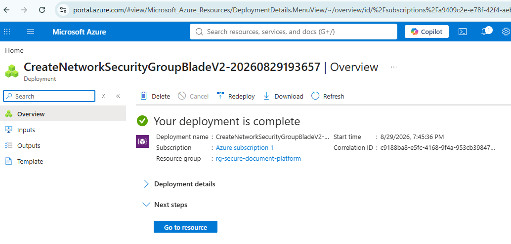
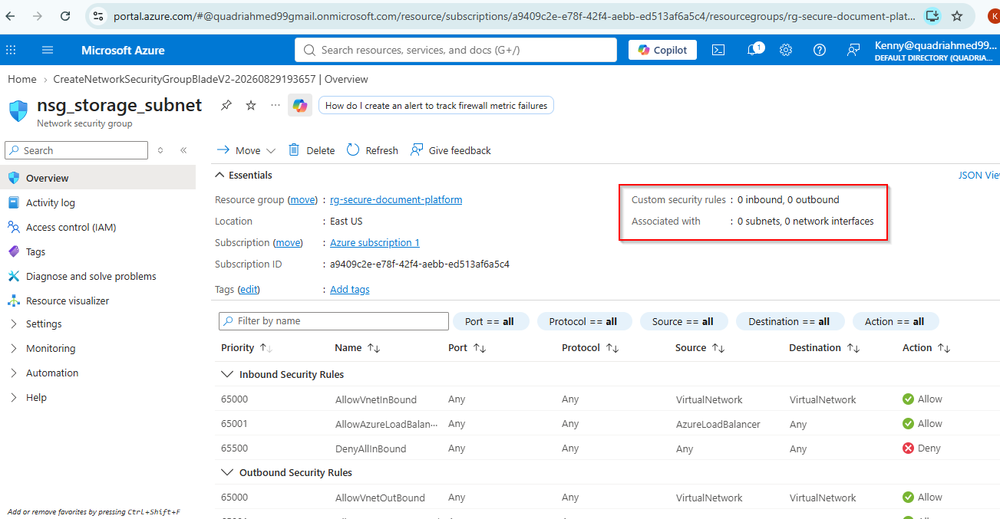
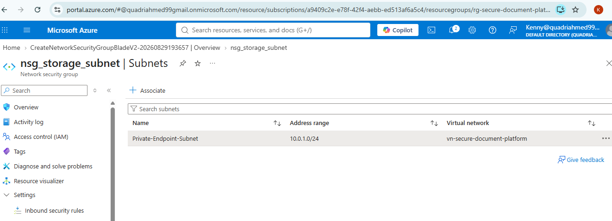
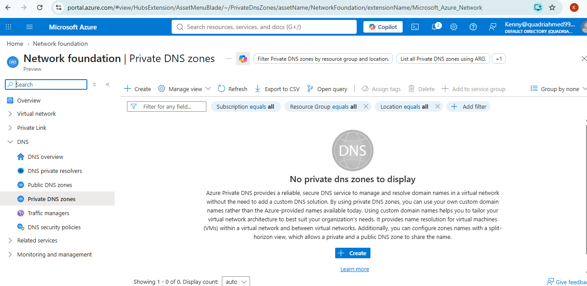
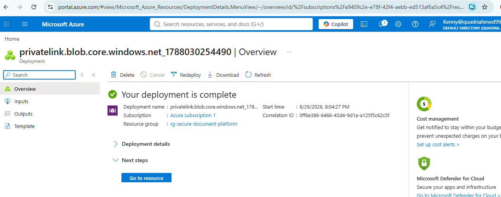
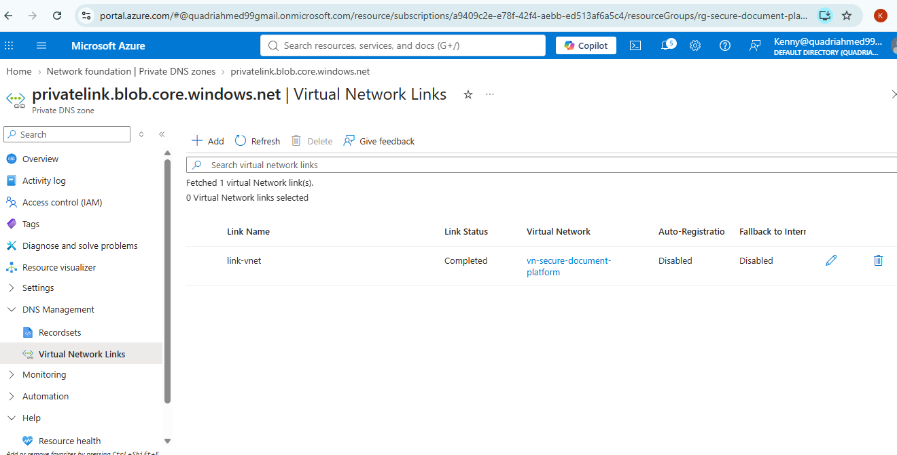

# Secure Document Platform: Private Endpoint Network Security Setup

Network security and private DNS configuration prepared for a Storage Account Private Endpoint, as part of the secure document platform project.

**Author:** Kehinde Oyewumi
**Resource Group:** rg-secure-document-platform
**Region:** East US

## What this covers

This task was scoped to the network security and DNS groundwork required before a Storage Account Private Endpoint is connected, not the endpoint connection itself. That covers:

- Creating a Network Security Group (NSG) and applying it to the subnet reserved for the private endpoint
- Provisioning a Private DNS zone for Storage Account blob private link resolution
- Linking that DNS zone to the virtual network, with auto-registration and internet fallback both disabled

The Private Endpoint itself has intentionally not been connected to Blob Storage yet. That is a deliberate scope boundary for this task, not something left unfinished.

## Configuration summary

| Setting | Value |
|---|---|
| Virtual Network | vn-secure-document-platform |
| Subnet | Private-Endpoint-Subnet (10.0.1.0/24) |
| NSG | nsg_storage_subnet |
| Private DNS Zone | privatelink.blob.core.windows.net |
| VNet Link | link-vnet |
| Auto-Registration | Disabled |
| Fallback to Internet | Disabled |

## Full documentation

The complete writeup, with configuration detail, security reasoning, a troubleshooting log, and a validation checklist, is in [docs/network-monitoring-plan.md](docs/network-monitoring-plan.md).

## Screenshots

All supporting screenshots are in [docs/images](docs/images):

| File | Shows |
|---|---|
| `1.png` | NSG deployment completion |
| `2.png` | NSG rules overview (inbound and outbound) |
| `3.png` | NSG associated to Private-Endpoint-Subnet |
| `4.png` | Private DNS zones list before zone creation |
| `5.png` | Private DNS zone deployment completion |
| `6.png` | Virtual Network Links page, link-vnet connected |

## Next step

With this in place, the next task is connecting the Private Endpoint itself to the Blob Storage account, which will use the NSG and DNS zone configured here without needing any further network changes.

#What I Learned

I learned how Network Security Groups control traffic at the subnet boundary, and that the default rules (AllowVnetInBound, AllowAzureLoadBalancing, DenyAllInbound) already provide a reasonable baseline before any custom rules are added.

I also learned that Private DNS zone names for Azure services follow an exact required naming convention, and that the zone name has to match precisely for the service to resolve correctly.

**I also learned that disabling auto-registration and internet fallback on a VNet link keeps the DNS zone limited to intentional entries and prevents lookups from silently falling back to public DNS.**

____________________________________________________________________________________________________________________________

#Problems I Faced

* I initially could not see the Virtual Network Links option under the Private DNS zone due to a permissions issue.

* The VNet link showed a red/failed status the first time, which I later traced to a naming conflict.

____________________________________________________________________________________________________________________________

#How I Fixed It

* I asked my team lead for the correct role assignment, which resolved the permissions issue and gave me access to Virtual Network Links.

* I created the link again using a new name, `link-vnet`, which resolved the red status and completed successfully.

____________________________________________________________________________________________________________________________

#Final Result

The network security and private DNS configuration for the Storage Account Private Endpoint was completed successfully and is ready for the Private Endpoint connection step.

The completed configuration includes:

* NSG created and deployed
  

* NSG rules configured
  

* NSG associated to the Private Endpoint subnet
  

* Private DNS zones list before zone creation
  

* Private DNS zone deployed
  

* Virtual Network Link connected
  

The Private Endpoint itself has not been connected to Blob Storage yet, as required by the task scope. This provides the network security and DNS foundation needed for that connection to be added next.

#What I Learned

I learned how Network Security Groups control traffic at the subnet boundary, and that the default rules (AllowVnetInBound, AllowAzureLoadBalancing, DenyAllInbound) already provide a reasonable baseline before any custom rules are added.

I also learned that Private DNS zone names for Azure services follow an exact required naming convention, and that the zone name has to match precisely for the service to resolve correctly.

**I also learned that disabling auto-registration and internet fallback on a VNet link keeps the DNS zone limited to intentional entries and prevents lookups from silently falling back to public DNS.**

____________________________________________________________________________________________________________________________

#Problems I Faced

* I initially could not see the Virtual Network Links option under the Private DNS zone due to a permissions issue.

* The VNet link showed a red/failed status the first time, which I later traced to a naming conflict.

____________________________________________________________________________________________________________________________

#How I Fixed It

* I asked my team lead for the correct role assignment, which resolved the permissions issue and gave me access to Virtual Network Links.

* I created the link again using a new name, `link-vnet`, which resolved the red status and completed successfully.

____________________________________________________________________________________________________________________________

#Final Result

The network security and private DNS configuration for the Storage Account Private Endpoint was completed successfully and is ready for the Private Endpoint connection step.

The completed configuration includes:

* NSG created and deployed
  

* NSG rules configured
  

* NSG associated to the Private Endpoint subnet
  

* Private DNS zones list before zone creation
  

* Private DNS zone deployed
  

* Virtual Network Link connected
  

The Private Endpoint itself has not been connected to Blob Storage yet, as required by the task scope. This provides the network security and DNS foundation needed for that connection to be added next.
