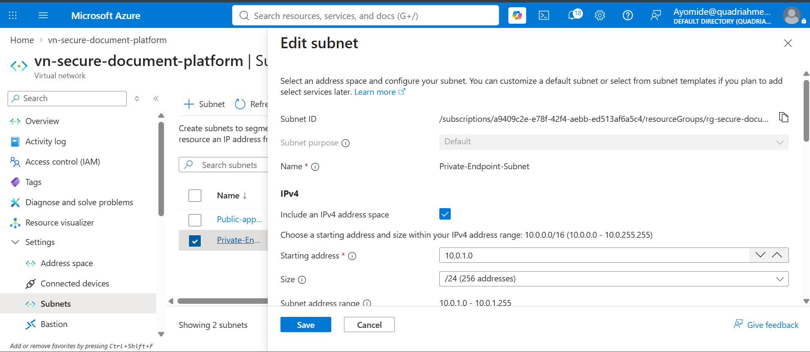

#**My Responsibilities**
```
* Azure Virtual Network (VNet)
* Application Subnet
* Private Endpoint Subnet
* Network Configuration Documentation
```

____________________________________________________________________________________________________________________________

#**Day 1**

#What I Did

I set up the Azure network infrastructure required for the application.

I created:
```
* An Azure Virtual Network (VNet)
* An application subnet
* A dedicated subnet for the Private Endpoint
```

I also documented the names and configurations of the VNet and subnets for the project.

#Azure Network Configuration
```
                                      Name
Virtual Network                       vn-secure-document-platform
Application Subnet	                  Public-app-subnet1
Private Endpoint Subnet	              Private-Endpoint-Subnet
```
_____________________________________________________________________________________________________________________________

#What I Learned

I learned how Azure Virtual Networks provide isolated networking for cloud applications.

I also learned the purpose of different subnets within a VNet:

* Application Subnet — provides a dedicated network segment for application resources.
* Private Endpoint Subnet — provides a dedicated network segment for resources that use Azure Private Endpoints.
* VNet — provides the overall private network boundary that contains the subnets.

**I also learned that separating resources into different subnets helps with network organization, security, and access control.**

___________________________________________________________________________________________________________________________________

#Problems I Faced

* One of the challenges was understanding how to structure the VNet and determine which resources should be placed in each subnet.
  
* I also had to make sure that the subnet configuration was suitable for the application’s networking requirements.

____________________________________________________________________________________________________________________________________

#How I Fixed It

* I reviewed the Azure networking requirements and configured separate subnets for the application and Private Endpoint.
  
* I then verified the VNet and subnet configurations in the Azure Portal and documented the configuration for the project.

____________________________________________________________________________________________________________________________________

#Final Result

The Azure network infrastructure was successfully created and is ready to support the application.

The completed configuration includes:

* Working Azure VNet
  

* Subnets Created
  
  
* Application subnet
  
  
* Private Endpoint subnet
  
  
* Documented network configuration

This provides the networking foundation required for the Azure application.
