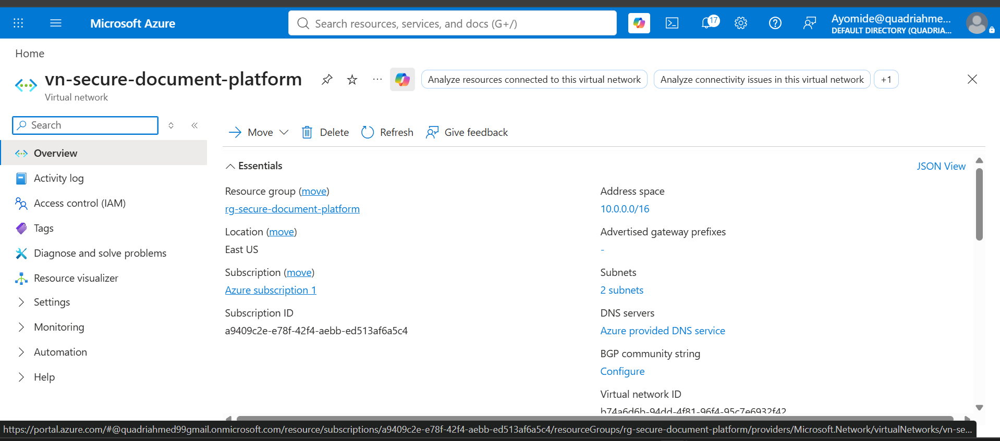
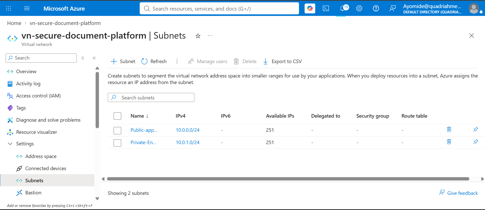
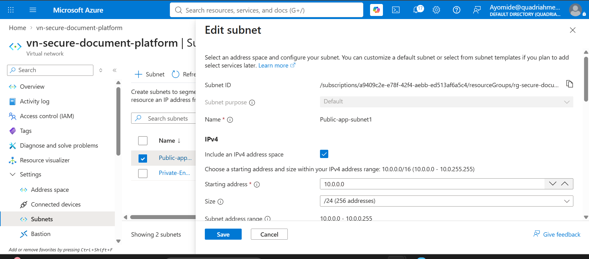

#**My Responsibilities**
```
* Azure Virtual Network (VNet)
* Application Subnet
* Private Endpoint Subnet
* Network Configuration Documentation
```

____________________________________________________________________________________________________________________________

#**Day 1**

#What I Did

I set up the Azure network infrastructure required for the application.

I created:
```
* An Azure Virtual Network (VNet)
* An application subnet
* A dedicated subnet for the Private Endpoint
```

I also documented the names and configurations of the VNet and subnets for the project.

#Azure Network Configuration
```
                                      Name
Virtual Network                       vn-secure-document-platform
Application Subnet	                  Public-app-subnet1
Private Endpoint Subnet	              Private-Endpoint-Subnet
```
_____________________________________________________________________________________________________________________________

#What I Learned

I learned how Azure Virtual Networks provide isolated networking for cloud applications.

I also learned the purpose of different subnets within a VNet:

* Application Subnet — provides a dedicated network segment for application resources.
* Private Endpoint Subnet — provides a dedicated network segment for resources that use Azure Private Endpoints.
* VNet — provides the overall private network boundary that contains the subnets.

**I also learned that separating resources into different subnets helps with network organization, security, and access control.**

___________________________________________________________________________________________________________________________________

#Problems I Faced

* One of the challenges was understanding how to structure the VNet and determine which resources should be placed in each subnet.
  
* I also had to make sure that the subnet configuration was suitable for the application’s networking requirements.

____________________________________________________________________________________________________________________________________

#How I Fixed It

* I reviewed the Azure networking requirements and configured separate subnets for the application and Private Endpoint.
  
* I then verified the VNet and subnet configurations in the Azure Portal and documented the configuration for the project.

____________________________________________________________________________________________________________________________________

#Final Result

The Azure network infrastructure was successfully created and is ready to support the application.

The completed configuration includes:

* Working Azure VNet
  

* Subnets Created
  
  
* Application subnet
  
  
* Private Endpoint subnet
  
  
* Documented network configuration

This provides the networking foundation required for the Azure application.


____________________________________________________________________________________________________________________________

#**Day 1**

#What I Did

I set up the network security and private DNS configuration required for the Storage Account Private Endpoint.

I created:
```
* A Network Security Group (NSG) for the Private Endpoint subnet
* An NSG association to the Private-Endpoint-Subnet
* A Private DNS zone for Storage Account private link resolution
* A Virtual Network Link connecting the DNS zone to the VNet
```

I did not connect the Private Endpoint to Blob Storage yet, as this was outside the scope of this task.

#Azure Network Security and DNS Configuration
```
                                      Name
NSG                                    nsg_storage_subnet
NSG Associated Subnet                  Private-Endpoint-Subnet (10.0.1.0/24)
Private DNS Zone                       privatelink.blob.core.windows.net
VNet Link                              link-vnet
Auto-Registration                      Disabled
Fallback to Internet                   Disabled
```

#What I Learned

I learned how Network Security Groups control traffic at the subnet boundary, and that the default rules (AllowVnetInBound, AllowAzureLoadBalancing, DenyAllInbound) already provide a reasonable baseline before any custom rules are added.

I also learned that Private DNS zone names for Azure services follow an exact required naming convention, and that the zone name has to match precisely for the service to resolve correctly.

**I also learned that disabling auto-registration and internet fallback on a VNet link keeps the DNS zone limited to intentional entries and prevents lookups from silently falling back to public DNS.**

____________________________________________________________________________________________________________________________

#Problems I Faced

* I initially could not see the Virtual Network Links option under the Private DNS zone due to a permissions issue.

* The VNet link showed a red/failed status the first time, which I later traced to a naming conflict.

____________________________________________________________________________________________________________________________

#How I Fixed It

* I asked my team lead for the correct role assignment, which resolved the permissions issue and gave me access to Virtual Network Links.

* I created the link again using a new name, `link-vnet`, which resolved the red status and completed successfully.

____________________________________________________________________________________________________________________________

#Final Result

The network security and private DNS configuration for the Storage Account Private Endpoint was completed successfully and is ready for the Private Endpoint connection step.

The completed configuration includes:

* NSG created and deployed
  

* NSG rules configured
  

* NSG associated to the Private Endpoint subnet
  

* Private DNS zones list before zone creation
  

* Private DNS zone deployed
  

* Virtual Network Link connected
  

The Private Endpoint itself has not been connected to Blob Storage yet, as required by the task scope. This provides the network security and DNS foundation needed for that connection to be added next.
